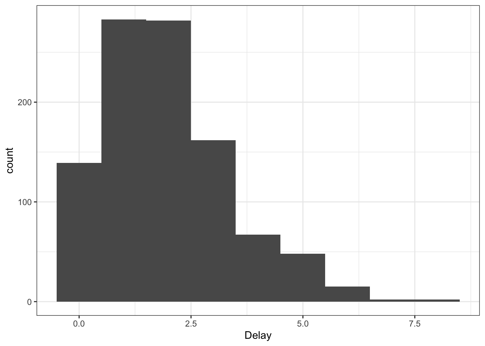
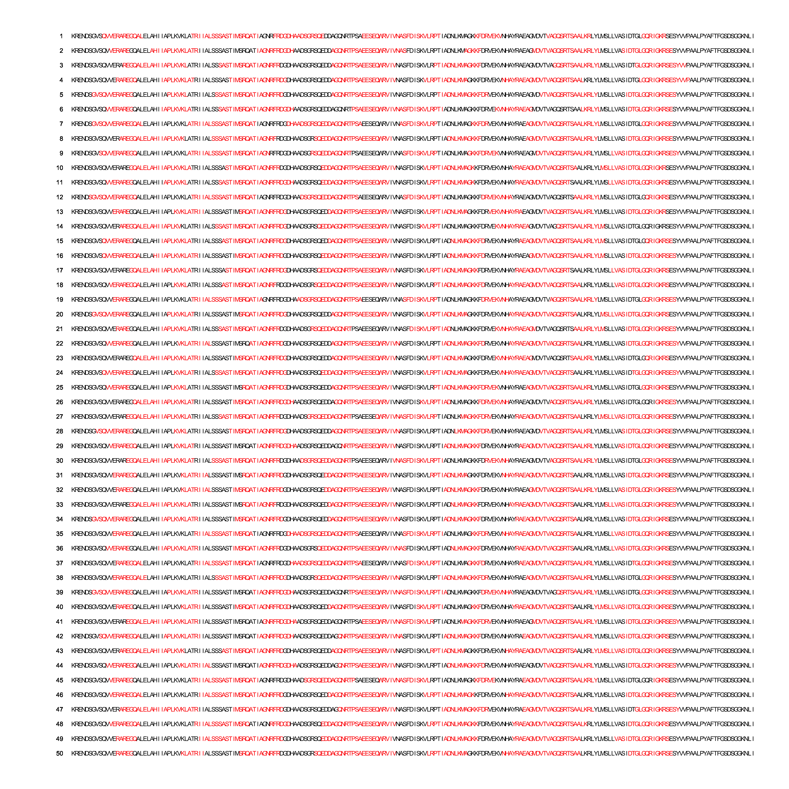
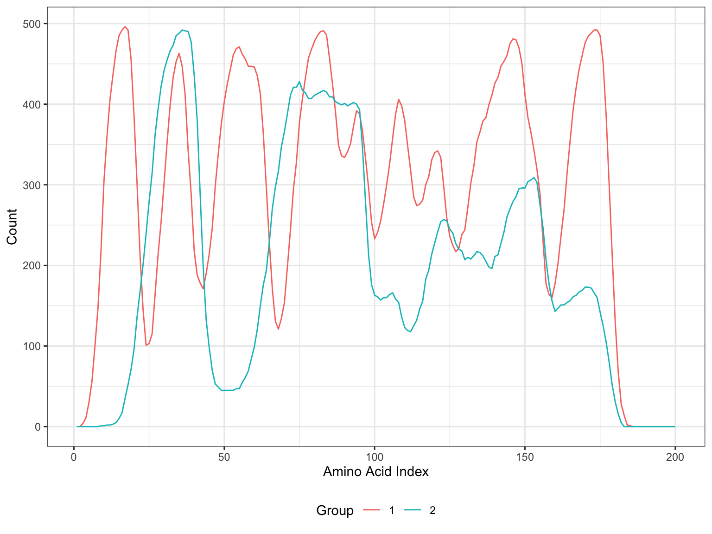
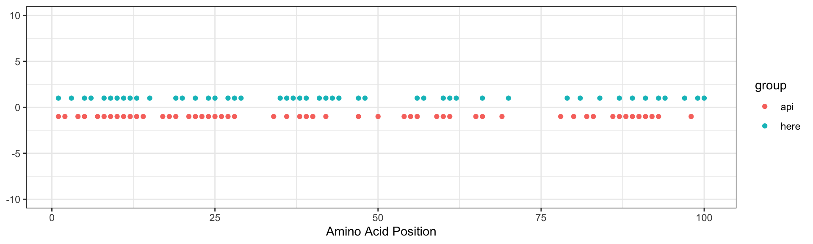
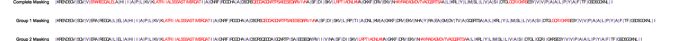

``` r
#packages
library(ggplot2)
library(dplyr)
library(OrgMassSpecR)
```


``` r
#utils
here::i_am("Code/protein_sequence_simulation.R")

source(here::here("Code", "ptm_utils.R"))
```


## Protein Simulation using Real Data

We can use real data to generate probabilities for selecting each amino acid


``` r
lip_data = readr::read_tsv(here::here("Data", "double_pept_lytic_sites.tsv"))

all_peptides = unlist(lapply(lip_data$Sequence, \(x) strsplit(x, split = '; ')[[1]]))

unique_peptides = unique(all_peptides)

# Lets look at the frequency of each amino acid in the real data
amino_acids = unlist(lapply(unique_peptides, \(x) strsplit(x, split = "")[[1]]))
barplot(table(amino_acids), xlab = "Amino Acids", ylab = "Frequency", main = "Amino Acid Frequency Plot")
```


Then using those probabilities, sample a synthetic protein with similar structural properties

``` r
amino_acid_distribution = create_amino_acid_distribution(amino_acids)
synthetic_protein = generate_protein(1000, amino_acid_distribution)
synthetic_amino_acids = unlist(lapply(synthetic_protein, \(x) strsplit(x, split = "")[[1]]))

barplot(table(synthetic_amino_acids), xlab = "(Synthetic) Amino Acids", ylab = "Frequency", main = "(Synthetic) Amino Acid Frequency Plot\nFrom 1000 sampled amino acids")
```


## Sequence Masking

We can mask regions of a sequence to simulate how proteins are initially digested in LiP. This essentially will introduce an artificial "folding" in the protein. We do this by moving through each amino acid from the start of the sequence, and flag sequential amino acids as a "masked region" until a stopping criteria is reached. This is repeated until the end of the sequence is reached. Here, our stopping criteria is simple: either a specified number of trypsin digestion sites are contained in the region, or a maximum region size are reached. We also add a delay to the end of a masked region so that it doesn't always end on a trypsin site, and a gap between masked regions which will be left unmasked. We do this randomly by introducing "gap" and "delay" distributions, which can be any function returning a non-negative integer. Here we use simple Poisson distributions.


``` r
get_mask_indices = function(
  sequence,
  start, 
  delay_fn, 
  max_masked_region_size, 
  min_num_trypsin_sites
){
  if(start > length(amino_acids)) stop("Start position is larger than sequence length")
  adjusted_start = start + delay_fn()
  curr_ind = adjusted_start
  amino_acids = unlist(lapply(sequence, \(x) strsplit(x, split = "")[[1]]))
  n_trypsin_sites = 0
  region_size = 0
  
  # Check if the adjusted start is valid
  if(adjusted_start > length(amino_acids)){
    return(list(start = start, stop = Inf)) #stop at inf to flag finished procedure (this one will be tossed out)
  }
  
  #check if one of the conditions can be satisfied
  remaining_amino_acids = amino_acids[adjusted_start:length(amino_acids)]
  remaining_spit_sites = sum(grepl("R", remaining_amino_acids) | grepl("K", remaining_amino_acids))
  if(length(remaining_amino_acids) < max_masked_region_size & remaining_spit_sites < min_num_trypsin_sites){
    return(list(start = adjusted_start, stop = Inf)) #stop at inf to flag finished procedure (this one will be tossed out)
  }
  

  while(n_trypsin_sites < min_num_trypsin_sites & region_size < max_masked_region_size){
    curr_amino_acid = amino_acids[curr_ind]
    if(curr_amino_acid == "K" | curr_amino_acid == "R"){
      n_trypsin_sites = n_trypsin_sites + 1
    }
    region_size = region_size + 1
    curr_ind = curr_ind + 1
  }
  end_ind = curr_ind + delay_fn()
  return(list(start = adjusted_start, stop = end_ind))
}

mask_sequence = function(
    sequence,
    delay_fn, 
    gap_fn,
    max_masked_region_size, 
    min_num_trypsin_sites
  ){
  start_vec = c()
  stop_vec = c()
  curr_start = 1 + gap_fn()
  last_stop = 0
  masked_sequence = sequence
  while(last_stop < nchar(sequence)){
    mask_indices = get_mask_indices(
      sequence =sequence,
      start = curr_start,
      delay_fn = delay_fn,
      max_masked_region_size = max_masked_region_size,
      min_num_trypsin_sites = min_num_trypsin_sites
    )
    last_stop = mask_indices$stop
    curr_start = mask_indices$stop + gap_fn()
    if(!(last_stop > nchar(sequence) | curr_start > nchar(sequence))){
      start_vec = c(start_vec, mask_indices$start)
      stop_vec = c(stop_vec, mask_indices$stop)
      masked_sequence = replace_between_indices(masked_sequence, mask_indices$start, mask_indices$stop, '#')
    }
  }
  return(list(sequence = sequence, masked_sequence = masked_sequence, start_vec = start_vec, stop_vec = stop_vec))
}

replace_between_indices = function(x, start, stop, replacement) {
  before = substr(x, 1, start - 1)
  after = substr(x, stop + 1, nchar(x))
  replacement_string = strrep(replacement, stop - start + 1)
  result = paste0(before, replacement_string, after)
  return(result)
}
```


``` r
sample_gap = function() rpois(1, 10)
sample_delay = function() rpois(1, 2)
```


### Gap Distribution

``` r
ggplot(data.frame(values = replicate(1000, sample_gap())), aes(x = values)) + 
  geom_histogram(binwidth = 1) + 
  xlab("Gap") + 
  theme_bw()
```


### Delay Distribution

``` r
ggplot(data.frame(values = replicate(1000, sample_delay())), aes(x = values)) + 
  geom_histogram(binwidth = 1) + 
  xlab("Delay") +
  theme_bw()
```




### Masking Example

Here we generate a synthetic protein of length 200, and mask it 50 different time. We require at least 2 trypsin digestion sites in the sequence with a maximum masked region size of 50


``` r
synthetic_protein = generate_protein(200, amino_acid_distribution)
max_masked_region_size = 50
min_num_trypsin_sites = 2


n_reps = 50
out_list = vector('list', n_reps)
for(i in seq_len(n_reps)){
  out_list[[i]] = mask_sequence(
    sequence = synthetic_protein,
    delay_fn = sample_delay,
    gap_fn = sample_gap,
    max_masked_region_size = max_masked_region_size,
    min_num_trypsin_sites = min_num_trypsin_sites
  )
}
```


``` r
create_sequence_plot = function(list_of_sequences) {
  
  # Get the names of the sequences, or use row numbers if names are not provided
  sequence_names = if (!is.null(names(list_of_sequences))) names(list_of_sequences) else seq_along(list_of_sequences)
  
  plot_data = lapply(seq_along(list_of_sequences), function(i) {
    seq_list = list_of_sequences[[i]]
    sequence = seq_list$sequence
    masked_sequence = seq_list$masked_sequence
    
    data.frame(
      row = i,
      label = sequence_names[i],
      position = 1:nchar(sequence),
      letter = strsplit(sequence, "")[[1]],
      color = ifelse(strsplit(masked_sequence, "")[[1]] == "#", "red", "black")
    )
  }) %>% bind_rows()
  
  ggplot(plot_data, aes(x = position, y = -row, label = letter, color = color)) +
    geom_text(size = 4) +
    geom_text(aes(x = -2, y = -row, label = label), hjust = 1, size = 4, color = "black") +
    scale_color_identity() +
    scale_y_continuous(breaks = -seq_along(list_of_sequences), labels = NULL) +
    expand_limits(x = c(-10, NA)) +
    theme_void() +
    theme(legend.position = "none") +
    coord_cartesian(clip = "off")
}
```

Below, we display the synthetic sequence along with the masked regions (in red)

``` r
create_sequence_plot(out_list)
```



## Inducing Group Effect

There are two obvious ways group effects could be induced, we go over both here.

### Downsampling from a "complete" masked sequence

Here, we can simulate a "complete" masked sequence, which has all possible masked regions. Groups are made distinct by downsampling from the complete masked sequence in different ways.


``` r
max_masked_region_size = 50
min_num_trypsin_sites = 2


complete_masked_sequence = mask_sequence(
    sequence = synthetic_protein,
    delay_fn = sample_delay,
    gap_fn = sample_gap,
    max_masked_region_size = max_masked_region_size,
    min_num_trypsin_sites = min_num_trypsin_sites
  )
```

We just do naive downsampling here, that is, a fixed proportion of masked regions are selected from the complete set for each group


``` r
downsample_masking = function(
    regions_start, 
    downsample_fn, 
    ...
    ){
  downsample_fn(regions_start, ...)
}

downsample_fn = function(vec, prop) sample(vec, floor(prop * length(vec)))
```


``` r
remask_sequence = function(sequence, start_vec, stop_vec){
  masked_sequence = sequence
  for(i in seq_along(start_vec)){
    masked_sequence = replace_between_indices(masked_sequence, start_vec[i], stop_vec[i], '#')
  }
  return(masked_sequence)
}

g1_indices = downsample_masking(seq_along(complete_masked_sequence$start_vec), downsample_fn, 0.5)
g1_masked_sequence = complete_masked_sequence
g1_masked_sequence$start_vec = g1_masked_sequence$start_vec[g1_indices]
g1_masked_sequence$stop_vec = g1_masked_sequence$stop_vec[g1_indices]
g1_masked_sequence$masked_sequence = remask_sequence(g1_masked_sequence$sequence, g1_masked_sequence$start_vec, g1_masked_sequence$stop_vec)

g2_indices = downsample_masking(seq_along(complete_masked_sequence$start_vec), downsample_fn, 0.5)
g2_masked_sequence = complete_masked_sequence
g2_masked_sequence$start_vec = g2_masked_sequence$start_vec[g2_indices]
g2_masked_sequence$stop_vec = g2_masked_sequence$stop_vec[g2_indices]
g2_masked_sequence$masked_sequence = remask_sequence(g2_masked_sequence$sequence, g2_masked_sequence$start_vec, g2_masked_sequence$stop_vec)
```


``` r
create_sequence_plot(
  list(
    "Complete Masking" = complete_masked_sequence, 
    "Group 1 Masking" = g1_masked_sequence, 
    "Group 2 Masking" = g2_masked_sequence
    )
  )
```


### Adjusting the gap/delay distributions

We can also be a bit more sophisticated and alter the masking generating mechanism itself. This can be done by tweaking 4 parameters:        
1. Delay distribution    
2. Gap distribution    
3. Maximum masked region size    
4. Minimum number of trypsin sites per masked region    


``` r
sample_gap_g1 = function() rpois(1, 5)
sample_delay_g1 = function() rpois(1, 4)
max_masked_region_size = 100
min_num_trypsin_sites = 2

n_reps = 500

masked_mat = matrix('', nrow = n_reps, ncol = nchar(synthetic_protein))
for(i in seq_len(n_reps)){
  masked_sequence = mask_sequence(
    sequence = synthetic_protein,
    delay_fn = sample_delay_g1,
    gap_fn = sample_gap_g1,
    max_masked_region_size = max_masked_region_size,
    min_num_trypsin_sites = min_num_trypsin_sites
  )$masked_sequence
  
  masked_mat[i,] = strsplit(masked_sequence, split = '')[[1]]
}

ggdat_g1 = data.frame(`Location` = seq_len(nchar(synthetic_protein)), Count = colSums(masked_mat == '#'), Group = "1")
```


``` r
sample_gap_g2 = function() rpois(1, 20)
sample_delay_g2 = function() rpois(1, 4)
max_masked_region_size = 100
min_num_trypsin_sites = 3

n_reps = 500

masked_mat = matrix('', nrow = n_reps, ncol = nchar(synthetic_protein))
for(i in seq_len(n_reps)){
  masked_sequence = mask_sequence(
    sequence = synthetic_protein,
    delay_fn = sample_delay_g2,
    gap_fn = sample_gap_g2,
    max_masked_region_size = max_masked_region_size,
    min_num_trypsin_sites = min_num_trypsin_sites
  )$masked_sequence
  
  masked_mat[i,] = strsplit(masked_sequence, split = '')[[1]]
}

ggdat_g2 = data.frame(`Location` = seq_len(nchar(synthetic_protein)), Count = colSums(masked_mat == '#'), Group = "2")
```

We simulate 500 sets of masked regions for the synthetic protein, and can visualize the different distribution of masked regions across groups

``` r
ggplot(rbind(ggdat_g1, ggdat_g2), aes(x = Location, y = Count, color = as.factor(Group))) + 
  geom_line() + 
  guides(color = guide_legend(title = "Group")) + 
  xlab("Amino Acid Index") + 
  theme_bw() + 
  theme(legend.position = 'bottom') 
```




## LiP Stage 1 Digestion

### Prototype Proteinase K synthetic digestion


``` r
simulate_proteinase_k_cleavage = function(sequence) {
  # Define amino acids considered for cleavage (aliphatic, aromatic, hydrophobic)
  cleavage_aa = c("A", "V", "L", "I", "F", "Y", "W", "M", "P")  # Aliphatic, aromatic, and hydrophobic residues

  # Convert the sequence to a character vector
  sequence_vector = unlist(strsplit(sequence, ""))
  
  # Initialize vectors to store peptide information
  peptides = c()
  start_indices = c()
  end_indices = c()
  
  # Initialize start index
  start = 1
  
  # Loop through the sequence to find potential cleavage sites
  for (i in 1:(length(sequence_vector) - 1)) {
    if (sequence_vector[i] %in% cleavage_aa) {
      peptides = c(peptides, paste(sequence_vector[start:i], collapse = ""))
      start_indices = c(start_indices, start)
      end_indices = c(end_indices, i)
      start = i + 1
    }
  }
  
  # Add the final peptide after the last cleavage site
  if (start <= length(sequence_vector)) {
    peptides = c(peptides, paste(sequence_vector[start:length(sequence_vector)], collapse = ""))
    start_indices = c(start_indices, start)
    end_indices = c(end_indices, length(sequence_vector))
  }
  
  # Create a dataframe
  cleavage_df = data.frame(
    peptide = peptides,
    start = start_indices,
    stop = end_indices,
    stringsAsFactors = FALSE
  )
  
  return(cleavage_df)
}

set.seed(1)
synthetic_protein2 = generate_protein(100, amino_acid_distribution)
result_df <- simulate_proteinase_k_cleavage(synthetic_protein2)
print(result_df)
```

```
##      peptide start stop
## 1         EV     1    2
## 2         SF     3    4
## 3          L     5    5
## 4         NY     6    7
## 5          I     8    8
## 6          I     9    9
## 7          A    10   10
## 8          L    11   11
## 9          L    12   12
## 10        TV    13   14
## 11      QDTW    15   18
## 12         V    19   19
## 13        QF    20   21
## 14        EI    22   23
## 15         L    24   24
## 16        EV    25   26
## 17         A    27   27
## 18         V    28   28
## 19    KGRSRL    29   34
## 20         P    35   35
## 21         I    36   36
## 22         P    37   37
## 23         L    38   38
## 24        TV    39   40
## 25         P    41   41
## 26         I    42   42
## 27         P    43   43
## 28       DDP    44   46
## 29         A    47   47
## 30  RQTRKREA    48   55
## 31         A    56   56
## 32       GDI    57   59
## 33         V    60   60
## 34         F    61   61
## 35      GRGI    62   65
## 36      ERQA    66   69
## 37 NGKGGRNKV    70   78
## 38        QY    79   80
## 39       RTV    81   83
## 40       GQL    84   86
## 41        TL    87   88
## 42        EL    89   90
## 43        EA    91   92
## 44         I    93   93
## 45       NQP    94   96
## 46        RV    97   98
## 47         P    99   99
## 48         S   100  100
```

``` r
print(synthetic_protein2)
```

```
## [1] "EVSFLNYIIALLTVQDTWVQFEILEVAVKGRSRLPIPLTVPIPDDPARQTRKREAAGDIVFGRGIERQANGKGGRNKVQYRTVGQLTLELEAINQPRVPS"
```

Compared to Expasy Peptide Cutter API:

``` r
api_cleavage_sites = c(1, 2, 4, 5, 7, 8, 9, 10, 11, 12, 13, 14, 17, 18, 19, 21, 22, 23, 24, 25, 26, 27, 28, 34, 36, 38, 39, 40, 42, 47, 50, 54, 55, 56, 59, 60, 61, 65, 66, 69, 78, 80, 82, 83, 86, 87, 88, 89, 90, 91, 92, 93, 98)
ggdat = data.frame(
  pos = c(result_df$start, api_cleavage_sites), 
  group = rep(c("here", "api"), times = c(length(result_df$start), length(api_cleavage_sites))),
  y = rep(c(1, -1), times = c(length(result_df$start), length(api_cleavage_sites))))

ggplot(ggdat, aes(y = y, x = pos, color = group)) + 
  geom_point() + 
  ylim(-10, 10) + 
  xlab("Amino Acid Position") + 
  ylab(NULL) + 
  theme_bw()
```



### Cleaving masked sequences

Now we can cleave our masked sequences for each group.


``` r
max_masked_region_size = 50
min_num_trypsin_sites = 2


complete_masked_sequence = mask_sequence(
    sequence = synthetic_protein,
    delay_fn = sample_delay,
    gap_fn = sample_gap,
    max_masked_region_size = max_masked_region_size,
    min_num_trypsin_sites = min_num_trypsin_sites
  )

g1_indices = downsample_masking(seq_along(complete_masked_sequence$start_vec), downsample_fn, 0.5)
g1_masked_sequence = complete_masked_sequence
g1_masked_sequence$start_vec = g1_masked_sequence$start_vec[g1_indices]
g1_masked_sequence$stop_vec = g1_masked_sequence$stop_vec[g1_indices]
g1_masked_sequence$masked_sequence = remask_sequence(g1_masked_sequence$sequence, g1_masked_sequence$start_vec, g1_masked_sequence$stop_vec)

g2_indices = downsample_masking(seq_along(complete_masked_sequence$start_vec), downsample_fn, 0.5)
g2_masked_sequence = complete_masked_sequence
g2_masked_sequence$start_vec = g2_masked_sequence$start_vec[g2_indices]
g2_masked_sequence$stop_vec = g2_masked_sequence$stop_vec[g2_indices]
g2_masked_sequence$masked_sequence = remask_sequence(g2_masked_sequence$sequence, g2_masked_sequence$start_vec, g2_masked_sequence$stop_vec)
```


``` r
perfect_digest_g1 = simulate_proteinase_k_cleavage(g1_masked_sequence$masked_sequence)
perfect_digest_g2 = simulate_proteinase_k_cleavage(g2_masked_sequence$masked_sequence)
perfect_digest_complete = simulate_proteinase_k_cleavage(complete_masked_sequence$masked_sequence)

insert_char_at_indices = function(string, indices, char = '|') {
  indices = sort(indices)
  indices = indices[indices >= 1 & indices <= nchar(string)]
  
  chars = unlist(strsplit(string, ""))
  
  offset = 0
  for (index in indices) {
    chars = append(chars, char, after = index + offset - 1)
    offset = offset + 1
  }
  
  new_string = paste(chars, collapse = "")
  
  return(new_string)
}

add_cleavage_characters = function(masked_sequence_dat, digest_results, char = '|'){
  masked_sequence_dat$masked_sequence = insert_char_at_indices(masked_sequence_dat$masked_sequence, digest_results$start, char = char)
  masked_sequence_dat$sequence = insert_char_at_indices(masked_sequence_dat$sequence, digest_results$start, char = char)
  
  return(masked_sequence_dat)
}

complete_masked_sequence_perfect_digest = add_cleavage_characters(complete_masked_sequence, perfect_digest_complete)
g1_masked_sequence_perfect_digest = add_cleavage_characters(g1_masked_sequence, perfect_digest_g1)
g2_masked_sequence_perfect_digest = add_cleavage_characters(g2_masked_sequence, perfect_digest_g2)
```

Plot all potential cleavage sites. '|' denotes a proteinase K cleavage location

``` r
create_sequence_plot_with_cleavage = function(list_of_sequences) {
  
  # Get the names of the sequences, or use row numbers if names are not provided
  sequence_names = if (!is.null(names(list_of_sequences))) names(list_of_sequences) else seq_along(list_of_sequences)
  
  plot_data = lapply(seq_along(list_of_sequences), function(i) {
    seq_list = list_of_sequences[[i]]
    sequence = seq_list$sequence
    masked_sequence = seq_list$masked_sequence
    
    data.frame(
      row = i,
      label = sequence_names[i],
      position = 1:nchar(masked_sequence),
      letter = strsplit(sequence, "")[[1]],
      color = ifelse(strsplit(masked_sequence, "")[[1]] == "|", "purple3", 
                     ifelse(strsplit(masked_sequence, "")[[1]] == "#", "red", "black"))
    )
  }) %>% bind_rows()
  
  ggplot(plot_data, aes(x = position, y = -row, label = letter, color = color)) +
    geom_text(size = 4) +
    geom_text(aes(x = -2, y = -row, label = label), hjust = 1, size = 4, color = "black") +
    scale_color_identity() +
    scale_y_continuous(breaks = -seq_along(list_of_sequences), labels = NULL) +
    expand_limits(x = c(-10, NA)) +
    theme_void() +
    theme(legend.position = "none") +
    coord_cartesian(clip = "off")
}
```


``` r
create_sequence_plot_with_cleavage(
  list(
    "Complete Masking" = complete_masked_sequence_perfect_digest, 
    "Group 1 Masking" = g1_masked_sequence_perfect_digest, 
    "Group 2 Masking" = g2_masked_sequence_perfect_digest
    )
  )
```



As before we can potentially down-sample the cleavage sites to simulate an imperfect digestion


``` r
imperfect_digest = function(
    ptm_site_mapping, 
    prop_to_miss#, 
    #peptide_coef
    ){
  n_peps = nrow(ptm_site_mapping)
  
  # coef_dat = data.frame(peptide = names(peptide_coef), Mult_Factor = exp(peptide_coef))
  # ptm_site_mapping = ptm_site_mapping %>% left_join(., coef_dat, by = "peptide")
  
  # TODO does the probability of a successful split depend on the peptide length?
  ptm_site_mapping = ptm_site_mapping %>% mutate(merge_with_next = (seq_len(n_peps) %in% sample(seq_len(n_peps)[-n_peps], round(prop_to_miss * (n_peps - 1)))))
  protein = ptm_site_mapping$protein %>% unique()
  
  remove_vec = rep(FALSE, nrow(ptm_site_mapping))
  ptm_site_mapping = ptm_site_mapping %>% as_tibble()
  
  for(i in seq_len(nrow(ptm_site_mapping) - 1)){
    if(ptm_site_mapping$merge_with_next[i]){
      peptide = paste0(ptm_site_mapping$peptide[i], ptm_site_mapping$peptide[i + 1])
      # mult_factor = ptm_site_mapping$Mult_Factor[i] * ptm_site_mapping$Mult_Factor[i + 1]
      start = ptm_site_mapping$start[i]
      stop = ptm_site_mapping$stop[i + 1]
      remove_vec[i] = TRUE
      merge_with_next = ptm_site_mapping$merge_with_next[i+1]
      # site =  paste(ptm_site_mapping$site[i], ptm_site_mapping$site[i + 1], sep = ';')
      
      
      ptm_site_mapping$peptide[i + 1] = peptide
      # ptm_site_mapping$Mult_Factor[i + 1] = mult_factor
      ptm_site_mapping$start[i + 1] = start
      ptm_site_mapping$stop[i + 1] = stop
      ptm_site_mapping$merge_with_next[i + 1] = merge_with_next
      # ptm_site_mapping$site[i + 1] = site
    }
  }
  return(ptm_site_mapping[!remove_vec,])
}


imperfect_digest_g1 = imperfect_digest(perfect_digest_g1, 0.5)
imperfect_digest_g2 = imperfect_digest(perfect_digest_g2, 0.5)

g1_masked_sequence_imperfect_digest = add_cleavage_characters(g1_masked_sequence, imperfect_digest_g1)
g2_masked_sequence_imperfect_digest = add_cleavage_characters(g2_masked_sequence, imperfect_digest_g2)
```

Plot imperfect cleavage sites


``` r
create_sequence_plot_with_cleavage(
  list(
    "Complete Masking" = complete_masked_sequence_perfect_digest, 
    "Group 1 Masking" = g1_masked_sequence_imperfect_digest, 
    "Group 2 Masking" = g2_masked_sequence_imperfect_digest
    )
  )
```


## "Denature" Protein and perform Trypsin Cleavage 

Now we unmask the proteins, and perform (imperfect) trypsin digestion


``` r
simulate_trypsin_cleavage = function(sequence) {
  cleavage_aa = c("K", "R")
  skip_aa = "P"
  
  cleavage_rule = function(prev_aa, curr_aa) {
    return(curr_aa %in% cleavage_aa && prev_aa != skip_aa)
  }

  sequence_vector = unlist(strsplit(sequence, ""))

  peptides = c()
  start_indices = c()
  end_indices = c()

  start = 1

  for (i in 1:(length(sequence_vector) - 1)) {
    if (cleavage_rule(sequence_vector[i], sequence_vector[i + 1])) {
      peptides = c(peptides, paste(sequence_vector[start:i], collapse = ""))
      start_indices = c(start_indices, start)
      end_indices = c(end_indices, i)
      start = i + 1
    }
  }

  if (start <= length(sequence_vector)) {
    peptides = c(peptides, paste(sequence_vector[start:length(sequence_vector)], collapse = ""))
    start_indices = c(start_indices, start)
    end_indices = c(end_indices, length(sequence_vector))
  }

  cleavage_df = data.frame(
    peptide = peptides,
    start = start_indices,
    stop = end_indices,
    stringsAsFactors = FALSE
  )

  return(cleavage_df)
}
```


``` r
g1_stage2_digest = simulate_trypsin_cleavage(g1_masked_sequence_imperfect_digest$sequence)
g2_stage2_digest = simulate_trypsin_cleavage(g2_masked_sequence_imperfect_digest$sequence)

g1_imperfect_digest = imperfect_digest(g1_stage2_digest, 0.5)
g2_imperfect_digest = imperfect_digest(g2_stage2_digest, 0.5)

g1_final_sequence = add_cleavage_characters(g1_masked_sequence_imperfect_digest, g1_stage2_digest, "&")
g2_final_sequence = add_cleavage_characters(g2_masked_sequence_imperfect_digest, g2_stage2_digest, "&")
```


``` r
create_sequence_plot_with_cleavage = function(list_of_sequences) {
  
  # Get the names of the sequences, or use row numbers if names are not provided
  sequence_names = if (!is.null(names(list_of_sequences))) names(list_of_sequences) else seq_along(list_of_sequences)
  
  plot_data = lapply(seq_along(list_of_sequences), function(i) {
    seq_list = list_of_sequences[[i]]
    sequence = seq_list$sequence
    masked_sequence = seq_list$masked_sequence
    
    data.frame(
      row = i,
      label = sequence_names[i],
      position = 1:nchar(masked_sequence),
      letter = strsplit(sequence, "")[[1]],
      color = ifelse(strsplit(masked_sequence, "")[[1]] == "&", "orange4", 
                     ifelse(strsplit(masked_sequence, "")[[1]] == "|", "purple3", 
                            ifelse(strsplit(masked_sequence, "")[[1]] == "#", "red", "black")))
    )
  }) %>% bind_rows()
  
  ggplot(plot_data, aes(x = position, y = -row, label = letter, color = color)) +
    geom_text(size = 4) +
    geom_text(aes(x = -2, y = -row, label = label), hjust = 1, size = 4, color = "black") +
    scale_color_identity() +
    scale_y_continuous(breaks = -seq_along(list_of_sequences), labels = NULL) +
    expand_limits(x = c(-10, NA)) +
    theme_void() +
    theme(legend.position = "none") +
    coord_cartesian(clip = "off")
}
```

... and we can visualize the fully cleaved sequences below. Again '|' denotes a proteinase K cleavage site, while '&' denotes a trypsin cleavage site. 


``` r
create_sequence_plot_with_cleavage(
  list(
    # "Complete Masking" = complete_masked_sequence_perfect_digest, 
    "Group 1 Masking" = g1_final_sequence, 
    "Group 2 Masking" = g2_final_sequence
    )
  )
```


## Simulating some data

Okay! Now lets actually use all of this to simulate some data we can make use of.


``` r
synthetic_proteins = list(
  generate_protein(1000, amino_acid_distribution),
  generate_protein(1000, amino_acid_distribution)
  )
max_masked_region_size = 50
min_num_trypsin_sites = 2


mask_all_proteins = function(
    sequences,
    delay_fn,
    gap_fn,
    max_masked_region_size,
    min_num_trypsin_sites){
  out_list = vector('list', length = length(sequences))
  for(i in seq_along(sequences)){
    out_list[[i]] = mask_sequence(
      sequence = sequences[[i]],
      delay_fn = sample_delay,
      gap_fn = sample_gap,
      max_masked_region_size = max_masked_region_size,
      min_num_trypsin_sites = min_num_trypsin_sites
    )
  }
  return(out_list)
}

complete_mask_out = mask_all_proteins(
    sequences = synthetic_proteins,
    delay_fn = sample_delay,
    gap_fn = sample_gap,
    max_masked_region_size = max_masked_region_size,
    min_num_trypsin_sites = min_num_trypsin_sites
  )
```


``` r
downsample_masking = function(
    masking_output,
    downsample_fn, 
    ...
    ){
  indices = downsample_fn(seq_along(masking_output$start_vec), ...)
  
  masking_output$start_vec = masking_output$start_vec[indices]
  masking_output$stop_vec = masking_output$stop_vec[indices]
  masking_output$masked_sequence = remask_sequence(
    masking_output$sequence, 
    masking_output$start_vec, 
    masking_output$stop_vec
    )
  return(masking_output)
}

downsample_maskings = function(
    masking_list,
    downsample_fn,
    ...){
  out_list = vector('list', length = length(masking_list))
  for(i in seq_along(masking_list)){
    out_list[[i]] = downsample_masking(
      masking_output = masking_list[[i]],
      downsample_fn = downsample_fn,
      ...
    )
  }
  return(out_list)
}

g1_mask_out = downsample_maskings(complete_mask_out, downsample_fn, prop = 0.8)
g2_mask_out = downsample_maskings(complete_mask_out, downsample_fn, prop = 0.8)

get_masked_sequences = function(masking_list){
  lapply(masking_list, \(x) x$masked_sequence)
}
get_sequences = function(masking_list){
  lapply(masking_list, \(x) x$sequence)
}
```

Proteinase K digestion

``` r
digest_proteins_PK = function(sequences){
  lapply(sequences, \(x) simulate_proteinase_k_cleavage(x))
}
```

Trypsin digestion

``` r
digest_proteins_trypsin = function(sequences){
  lapply(sequences, \(x) simulate_trypsin_cleavage(x))
}
```


``` r
get_cleavage_site_mapping = function(mask_out){
  digest_results_PK = digest_proteins_PK(get_masked_sequences(mask_out))
  digest_results_tryp = digest_proteins_trypsin(get_sequences(mask_out))
  
  proteinaseK_cleavage_sites = lapply(digest_results_PK, \(x) x$start[-1])
  trypsin_cleavage_sites = lapply(digest_results_tryp, \(x) x$start[-1])
  
  PK_dat = lapply(proteinaseK_cleavage_sites, \(x) data.frame(Site = x, PK = 1))
  TR_dat = lapply(trypsin_cleavage_sites, \(x) data.frame(Site = x, TR = -1))
  full_dat = lapply(
    seq_along(PK_dat), 
    \(x) full_join(PK_dat[[x]], TR_dat[[x]], by = "Site") %>% 
      tidyr::replace_na(., list(PK = 0, TR = 0)) %>%
      mutate(
        sum_col = PK + TR,
        Enzyme = case_match(
        sum_col,
        -1 ~ "Trypsin",
        0 ~ "Both",
        1 ~ "Proteinase K"
      )) %>%
      select(Site, Enzyme) %>%
      arrange(Site)
    )
  
  return(full_dat)
}

g1_cleavage_site_mapping = get_cleavage_site_mapping(g1_mask_out)
g2_cleavage_site_mapping = get_cleavage_site_mapping(g2_mask_out)
```


``` r
#get abundances for each protein
#map those abundances to peptides
#map those peptides to subjects

sequence_abundances = c(1000, 500)
```


